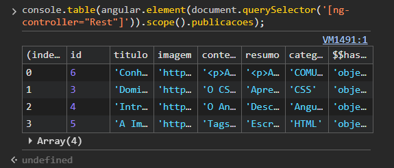

---

# README - Aula Blog (Supabase & AngularJS)

Este documento explica como gerenciar e manipular os dados (inserir, editar e excluir) da tabela `postagens` no banco de dados Supabase integrado a este projeto.

---

## 🛠️ Como Manipular o Banco de Dados

Todas as operações de banco de dados podem ser executadas diretamente pelo **Console do Desenvolvedor** do seu navegador (pressione `F12` ou clique com o botão direito > *Inspecionar* e vá na aba **Console**).

O objeto global `BlogAdmin` está disponível em qualquer página para gerenciar as postagens utilizando a API do Supabase.

---

### 1. Inserir (Criar) uma Nova Postagem

Para adicionar um novo post ao banco de dados, utilize a função `BlogAdmin.criar()`.

**Parâmetros:**

1. `title` (Título do post) - *Obrigatório*
2. `content` (Conteúdo completo em HTML ou texto) - *Obrigatório*
3. `category` (Categoria do post) - *Opcional* (Padrão: `'Estudos'`)
4. `image_url` (Link da imagem de capa) - *Opcional*

**Exemplo no Console:**

```javascript

BlogAdmin.criar(
    "Conhecendo Comunicação", 
    "A comunicação é fundamental nos dias atuais, atuando como a principal engrenagem que move a sociedade globalizada. Em um mundo hiperconectado, a velocidade com que as informações circulam transformou drasticamente a forma como vivemos, trabalhamos e nos relacionamos. Longe de ser apenas a troca de palavras, comunicar-se de maneira eficiente virou sinônimo de sobrevivência e sucesso em praticamente todas as esferas da vida moderna.   No ambiente profissional, a clareza na transmissão de ideias tornou-se uma das habilidades mais valorizadas pelo mercado. Profissionais que sabem ouvir com empatia e expressar suas visões de forma assertiva conseguem evitar ruídos, alinhar expectativas e liderar equipes com muito mais facilidade. Em tempos de trabalho remoto e ferramentas de mensagens instantâneas, uma mensagem mal interpretada pode gerar prejuízos reais, o que reforça a necessidade de uma comunicação precisa e humanizada.    Além disso, na vida pessoal e social, a comunicação é a base para a construção de conexões verdadeiras. Diante do bombardeio diário de dados e da superficialidade que muitas vezes domina as redes sociais, saber dialogar com profundidade virou uma arte essencial para o fortalecimento de laços familiares e de amizade.<br>Portanto, investir na melhoria da nossa capacidade de se comunicar não é um luxo, mas uma necessidade indispensável para quem deseja navegar com segurança e relevância na complexidade do século XXI. ", 
    "COMUNICAÇÃO", 
    "https://static.escolakids.uol.com.br/2020/08/meios-comunicacao.jpg"
);


```

---
### 🔍 Como Identificar o ID (Índice) de Cada Postagem

Para saber qual é o ID de cada post no banco de dados para poder editá-lo ou excluí-lo, abra o console do navegador (`F12`) e digite o comando abaixo:

 ```javascript

console.table(angular.element(document.querySelector('[ng-controller="Rest"]')).scope().publicacoes);

 ```

**O resultado aparecerá formatado diretamente no seu console:**



---
---

### 2. Modificar (Editar) uma Postagem Existente

Para atualizar informações de um post já existente, utilize a função `BlogAdmin.editar()`. Você precisa informar o ID do post e um objeto contendo apenas os campos que deseja alterar.

**Parâmetros:**

1. `id` (ID numérico ou identificador do post no banco) - *Obrigatório*
2. `updates` (Objeto com os campos a serem atualizados) - *Obrigatório*

**Exemplo no Console:**

```javascript

BlogAdmin.editar(1, { 
    title: "Título Atualizado do Post", 
    category: "JavaScript" 
});

```

---

### 3. Excluir (Deletar) uma Postagem

Para remover permanentemente um post do banco de dados, utilize a função `BlogAdmin.deletar()`.

**Parâmetros:**

1. `id` (ID do post que deseja remover) - *Obrigatório*

**Exemplo no Console:**

```javascript
BlogAdmin.deletar(1);

```

---

## 🚀 Como Executar o Projeto Localmente

1. Certifique-se de que os arquivos principais (`index.html`, `post.html`, `app.js`, `script.js` e `style.css`) estão na mesma pasta.
2. Abra o arquivo `index.html` utilizando um servidor local (como a extensão **Live Server** no Visual Studio Code).
3. O blog carregará automaticamente todas as postagens diretamente da tabela `postagens` configurada no Supabase.